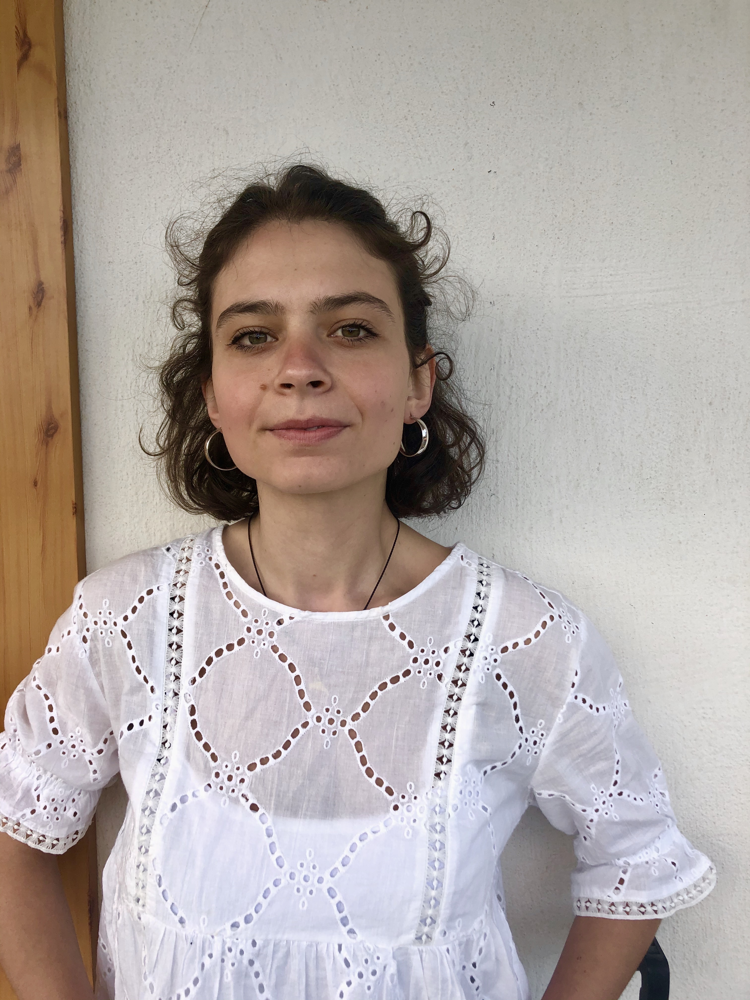

:::{#hero-heading}

:::

## Delia Della Porta
:::{.floatting}

```{r out.width='45%', out.extra='style="float:left; padding:20px"', echo=FALSE}

```


# Short Bio 
I am Delia, a PhD student at the [Institute of Neuroscience (IONS)](https://www.nocions.org/) at the Université Catholique de Louvain in Brussels. My research project, supported by FNRS-FRS funding, focuses on investigating how cognitive factors, particularly attention, impact central sensitization to pain. My interests span various aspects, including chronic pain, cognitive factors such as expectations and attention, and their roles in the development and maintenance of pain disorders. During my PhD, I designed experimental studies to investigate how selective attention affects the sensitization of the central nervous system induced in healthy volunteers using high-frequency electrical stimulation. Prior to my PhD, I obtained a master's degree in Clinical Psychology and Neuropsychology from the University of Florence. Following my master's program, I worked as a research assistant at Leiden University,in the department of Health Psychology and Neuropsychology collaborating on diverse projects focused on the role of verbal suggestions and conditioning to investigate pain and itch. I also worked in the Clinical Psychology Department, collaborating on projects focused on investigating resting state and EEG (electroencephalogram) theta beta ratio in relation to regulation of emotional responses to positive and negative stimuli. 

My **research interests** are:

* [Experimental design]{.highlight-color},
* [Mixed models]{.highlight-color},
* [Measurement and Methodology]{.highlight-color},
* [Designing of cognitive tasks, i.e., Working Memory tasks]{.highlight-color}
* [Open Science, Reproducibility]{.highlight-color},
* [Pre-registrations](https://osf.io/profile/)( following the link you can find all my projects including R scripts for sample size calculations and for follow-up analysis,DATA collected and more),
* Applications in [Health Psychology]{.highlight-color}

I speak **English** and **Italian** fluently. I am Italian but, at the end of my master's degree I moved to the Netherlands where I currently live. 

## Contact 
```{r, echo = FALSE}
df <- data.frame(what = c('<i class="fab fa-twitter"></i>',
                           '<i class="fas fa-envelope"></i>',
                           '<i class="fas fa-map-marker-alt"></i>'),
                 where = c("[@deliadellaporta](https://twitter.com/deliadellaporta)",
                           "[delia.dellaporta@uclouvain.be](mailto:delia.dellaporta@uclouvain.be)",
                           "Institute of Neuroscience,IONS,UCLouvain<br>Avenue Mounier 53/B1.53.04 <br>1200 Woluwe-Saint-Lambert <br>Belgium"))
knitr::kable(df, col.names = c("", ""), escape = FALSE)
```


```{r setup, include=FALSE}
knitr::opts_chunk$set(echo = FALSE)
```

:::
